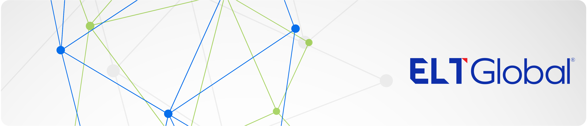

# 

This is the official Github organization of [ELT Global, Private Ltd.](https://eltglobal.in), parent company of [Triple i Commerce Academy](https://tripleica.com). We are a company with great ambitions to build the next generation of educational platforms.

## 🔒 Private development

Most of our repositories are private to protect our intellectual property and to maintain a competitive edge. Our projects encompass a wide range of initiatives aimed at enhancing educational experiences through technology. These include:

- **Triple i Educational Platform**: Client and API repositories for the client facing application where students can manage their learning and access various interactive and engaging online learning modules for professional commerce education.

- **Learning Management Systems (LMS)**: Repositories for comprehensive systems that handle course management, student tracking, and assessment tools.

- *More to come!*

Our development process involves close collaboration with educators, institutions, and other stakeholders to ensure our solutions meet the evolving needs of the education sector. We employ cutting-edge technologies and adhere to best practices in software development, ensuring our products are reliable, scalable, and secure.

## 🌍 Public development

But, we also 💖 Open Source! None of our work would've been possible without the amazing projects from the open source community. Here are some of the public projects we maintain:

- *Stay tuned! Some exiting projects to come.*

### 🤝 Contributing

We welcome contributions from everyone. Feel free to fork our public repositories and submit pull requests for improvements, fixes, or other changes you wish to incorporate. As long as it does not stray far from the objectives of the project, we shall review and merge it upstream.

### 📄 License

Most of our projects are released under the [MIT License](https://choosealicense.com/licenses/mit/). Check each repository for specific license information.

## 📬 Contact

Love to work with us? Or just want to say hi? We’d love to hear from you! For any inquiries, please reach out to us at [tech@eltglobal.in](mailto:tech@eltglobal.in).
